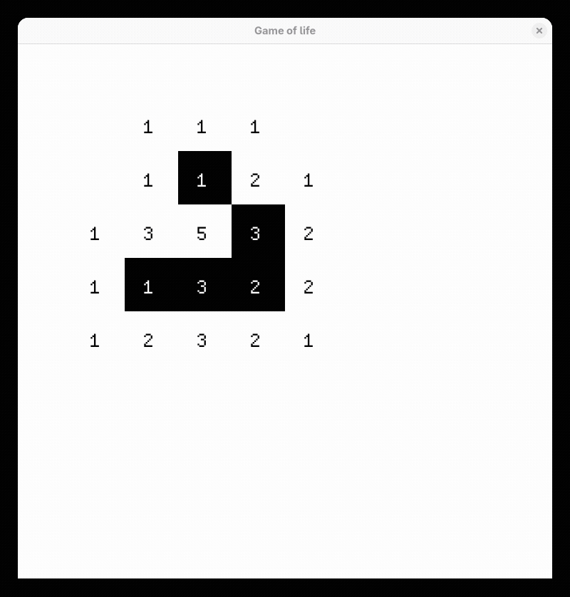

# Игра "Жизнь" Конвея

__Conway's Game of Life__ - это клеточный автомат, созданный математиком Джоном Ковеем в 1970 году.

## Идея

Есть сетка клеток. Каждая клетка либо __мертвая__, либо __живая__.

На каждом шаге каждая клетка смотрит на 8 соседей и определяет свое текущее состоянее:

- Мертвая клетка становится живой, если у неё **ровно 3 живых соседа**.
- Живая клетка остается живой, если у неё **2 или 3 живых соседа**.
- Живая клетка с **меньше чем 2 живыми соседями** умирает (одиночество).
- Живая клетка с **более чем 3 живыми соседями** умирает (перенаселение).

## Запуск

`cargo run`
